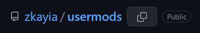
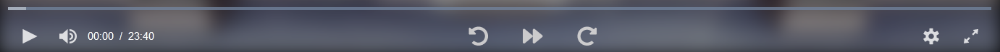
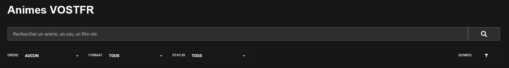

# Userscripts

## github_copy_repo.user.js

[Install](https://github.com/zkayia/usermods/raw/master/src/scripts/github_copy_repo.user.js)
|
[Source](github_copy_repo.user.js)

Adds a button to quickly copy the username/reponame pair to the clipboard.

## mal_mobile_tweaks_animelist.user.js

[Install](https://github.com/zkayia/usermods/raw/master/src/scripts/mal_mobile_tweaks_animelist.user.js)
|
[Source](mal_mobile_tweaks_animelist.user.js)

Replaces increment and edit details buttons.
Color is customisable.

Before | After
:---:|:---:
![Demo screenshot before][mal_mobile_tweaks_animelist_before]|![Demo screenshot after][mal_mobile_tweaks_animelist_after]

[mal_mobile_tweaks_animelist_before]: demos/mal_mobile_tweaks_animelist_before.png "Demo screenshot before"
[mal_mobile_tweaks_animelist_after]: demos/mal_mobile_tweaks_animelist_after.png "Demo screenshot after"

## mal_mobile_tweaks.user.js

[Install](https://github.com/zkayia/usermods/raw/master/src/scripts/mal_mobile_tweaks.user.js)
|
[Source](mal_mobile_tweaks.user.js)

Various tweaks to improve MAL's mobile site based on my preferences.

* Makes thumbnail clicks go to the recommendation page instead of the recommended anime/manga's page. Title click still go to the recommended anime/manga's page.
* Closes the "news", "staff", "pictures" and "external links" slides on page load. Opens the "related anime/manga" slide.

## nekosama_buttons.user.js

[Install](https://github.com/zkayia/usermods/raw/master/src/scripts/nekosama_buttons.user.js)
|
[Source](nekosama_buttons.user.js)

Adds 8s quick forward and backward buttons, plus a intro skip button (88s). Works on mobile aswell.

## nekosama_tweaks.user.js

[Install](https://github.com/zkayia/usermods/raw/master/src/scripts/nekosama_tweaks.user.js)
|
[Source](nekosama_tweaks.user.js)

Replaces the search on type bar with a search on confirm and adds a search button. The new bar updates search results only when pressing enter or clicking the search button, greatly reducing background and unnecessary work. Works on mobile aswell.

## wakapi_language_time.user.js

[Install](https://github.com/zkayia/usermods/raw/master/src/scripts/wakapi_language_time.user.js)
|
[Source](wakapi_language_time.user.js)

Adds the time spent per lang in [Wakapi's](https://wakapi.dev/) language chart.

Before | After
:---:|:---:
![Demo screenshot before][wakapi_language_time_before]|![Demo screenshot after][wakapi_language_time_after]

[wakapi_language_time_before]: demos/wakapi_language_time_before.png "Demo screenshot before"
[wakapi_language_time_after]: demos/wakapi_language_time_after.png "Demo screenshot after"
